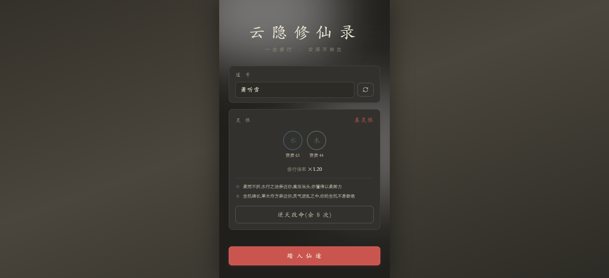
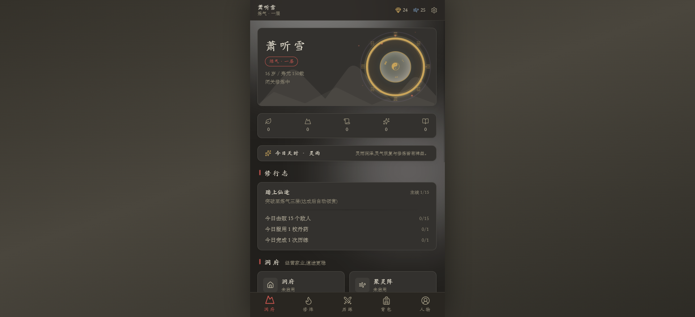

<div align="center">
  

  > 一念修行 · 云深不知处
  一款文字版修仙放置游戏，采用中国风视觉设计。

  [](https://github.com/setube/yunyin-xiuxian/releases/latest)
  [](https://creativecommons.org/licenses/by-nc/4.0)
</div>

## 游戏特色

**十境修行** — 炼气、筑基、金丹、元婴、化神、炼虚、合体、大乘、渡劫、真仙，每境九层至圆满；突破需渡劫，5 类天劫（雷鸣/逆流/裂魂/铁躯/重压）各有克制之法

**灵根定命** — 11 种灵根（金木水火土 + 风雷冰光暗 + 混沌），决定修炼速度、天劫减免与功法契合；33 种天赋分凡赋/灵赋/天赋/道赋四等

**功法悟道** — 33 部功法分主修、辅修、秘术三类，可同时装配；练至圆满开启悟道分支，77 条分支让同一部功法走出不同流派

**历练探险** — 20 个区域自青云山麓至九幽魔渊，60 种敌人；派遣式历练按时间安排遭遇，51 个随机事件 + 5 类机缘穿插其间，首领通关解锁下一区

**回合制战斗** — 战斗在后台一次性完整解算再回放：速度先手、暴击闪避、护盾吸血、反击连击、控制、法宝、流派组合技（玄罡反震/枯泽回春/锋连诀）全部参与推演

**装备构筑** — 10 个装备槽位、50 种模板、110 条词条、9 级品质（凡品→神品）；同类词条按 1/0.75/0.5/0.25 递减，攻击生命速度等超过软阈值后收益衰减，逼你搭配而非单堆

**洞府经营** — 7 种建筑（洞府/聚灵阵/炼丹炉/炼器台/灵田/藏经阁/灵兽园）离线产出，4 条灵脉（青木/赤炎/玉髓/寒冥）可投资分红

**炼丹炼器** — 9 门技艺（识材/辨药/配伍/凝丹/淬药/养丹/控火/锻打/铭纹）各自成长，32 种丹药、20 件法宝；技艺不足不是"不能炼"，而是炼出什么样的成品

**灵兽相伴** — 8 只灵兽（青羽灵狐/雪背小龟/赤火雀/月影狸/三足金蟾/摇光鹿/御雷猴/螭龙幼子），出战加成各异

**轮回转世** — 寿元耗尽入轮回，5 个阶段（初入轮回→熟知凡间→熟知修仙界→熟知天界→百世老修）逐世积累"见识"；15 种人生主题决定这一世的开局与禁忌，老修可自选

**真仙终局** — 4 条道途（剑道/长生道/天机道/杀伐道）、4 重天界（赤炎天/万刃天/无生天/无相天）远征、3 种试炼、6 种契约、8 类变数组合出每周期不同的规则宇宙；世界生成须过语义主题、平衡审计、新颖度三重门

**图鉴收藏** — 灵材谱、悟道录、敌人志逐条解锁；50 个成就、15 个主线任务、每日任务贯穿全程

**国风音画** — Tone.js 播放 FluidR3 真实乐器采样：古筝主旋律、琵琶对答、木鱼点击、太鼓鼓点、编钟突破、编磬提示

## 游戏截图





## 快速开始

需要 [Bun](https://bun.sh) 1.2+。

```bash
# 安装依赖
bun install

# 启动开发服务器
bun dev

# 类型检查 + 生产构建
bun run build

# 预览构建结果
bun preview

# 全量测试（数值/战斗/流派/曲线/经济/终局）
# 注意用 bun run test,不能用 bun test —— 后者会调 Bun 自带的测试器而非 Vitest
bun run test

# 按系统分类的测试摘要
bun run test:report

# ESLint
bun lint
```

### 多端构建

```bash
# Windows 桌面客户端（Electron，输出 pkg/*.zip）
bun run build:electron

# 同步 Web 产物到 Android 工程（Capacitor）
bun run build:android

# 直接出 Release APK（需 android/keystore.properties 提供签名）
bun run build:apk
```

### Docker 部署

```bash
# 方式一：使用预构建镜像（推荐）
docker run -d -p 8080:80 ghcr.io/setube/yunyin-xiuxian:latest

# 方式二：指定版本
docker run -d -p 8080:80 ghcr.io/setube/yunyin-xiuxian:<version>

# 方式三：本地构建镜像
docker build -t yunyin-xiuxian .
docker run -d -p 8080:80 yunyin-xiuxian
```

访问 `http://localhost:8080` 即可开始游戏。

## 技术栈

| 技术            | 版本  | 用途                                |
| --------------- | ----- | ----------------------------------- |
| Vue 3           | 3.5   | 组合式 API + `<script setup>`       |
| TypeScript      | 5.7   | strict 严格类型检查                 |
| Vite            | 6     | 构建与开发服务器                    |
| Pinia           | 3     | 状态管理（14 个 store，自动持久化） |
| Tailwind CSS    | 4     | `@theme` 定义水墨风格色彩系统       |
| Vue Router      | 4     | 客户端路由（hash 模式）             |
| Tone.js         | 15    | FluidR3 乐器采样播放（BGM + SFX）   |
| CryptoJS        | 4     | 存档 AES 加密                       |
| lucide-vue-next | 0.577 | 图标库                              |
| Vitest          | 3     | 单元测试与平衡审计                  |
| Electron        | 39    | Windows 桌面客户端打包              |
| Capacitor       | 8     | Android 客户端打包                  |

## 项目结构

```text
src/
├── data/           # 内容层：纯静态声明式定义（35 个模块）
│   ├── realms.ts       # 10 境界
│   ├── regions.ts      # 20 区域
│   ├── enemies.ts      # 60 敌人
│   ├── equipment.ts    # 50 装备模板
│   ├── affixes.ts      # 110 词条
│   ├── gongfa.ts       # 33 功法
│   ├── gongfaBranches.ts # 77 悟道分支
│   ├── pills.ts        # 32 丹药
│   ├── artifacts.ts    # 20 法宝
│   ├── endgame.ts      # 道途 / 天界 / 试炼
│   ├── mutators.ts     # 8 变数 × 8 主题
│   └── constants.ts    # 全局平衡参数
├── core/           # 逻辑层
│   ├── engine.ts       # 在线心跳驱动（1000ms）
│   ├── offline.ts      # 离线收益结算
│   ├── combat.ts       # 回合制战斗预解算
│   ├── formulas.ts     # 数值公式
│   ├── statsCalc.ts    # 属性聚合（词条递减 + 软阈值）
│   ├── equipGen.ts     # 装备实例生成
│   ├── exploration.ts  # 历练状态机
│   ├── loot.ts         # 掉落总入口
│   ├── progress.ts     # 任务成就横向总线
│   ├── worldGen.ts     # 终局世界生成（三重审计门）
│   └── *Sim.ts         # 平衡模拟器（构筑 / 经济 / 曲线 / 终局）
├── stores/         # Pinia 状态（14 个，绝大部分自动持久化）
├── views/          # 13 个页面
├── components/     # 组件
├── utils/          # GNum 大数（m×10^e）/ 格式化 / 随机 / 存档底层
├── composables/    # useNow 等
├── types/          # 领域类型定义
└── router/         # 路由与首次流程守卫
```

## 游戏系统一览

| 系统 | 说明                                                                         |
| ---- | ---------------------------------------------------------------------------- |
| 境界 | 10 境 × 10 层（九层 + 圆满），突破渡劫，5 类天劫                             |
| 灵根 | 11 种（五行 + 风雷冰光暗 + 混沌），影响修速、劫难减免、功法契合              |
| 天赋 | 33 种，分凡赋 / 灵赋 / 天赋 / 道赋四等                                       |
| 功法 | 33 部（主修 / 辅修 / 秘术），圆满后开启 77 条悟道分支                        |
| 历练 | 20 区域 × 60 敌人，派遣制会话，51 事件 + 5 机缘，首领解锁下一区              |
| 战斗 | 后台完整预解算再回放，速度 / 暴击 / 护盾 / 吸血 / 反击 / 控制 / 组合技       |
| 装备 | 10 槽位 × 50 模板 × 110 词条 × 9 品质，词条递减 + 软阈值                     |
| 洞府 | 7 建筑离线产出 + 4 条灵脉投资分红                                            |
| 技艺 | 9 门（识材 / 辨药 / 配伍 / 凝丹 / 淬药 / 养丹 / 控火 / 锻打 / 铭纹）独立成长 |
| 炼制 | 32 丹药 + 20 法宝，技艺水平决定成品品相而非成败                              |
| 灵兽 | 8 只，出战加成各异                                                           |
| 轮回 | 5 阶段积累见识，15 种人生主题定开局与禁忌                                    |
| 终局 | 4 道途 + 4 天界远征 + 3 试炼 + 6 契约 + 8 变数，道痕与道源双资源             |
| 任务 | 15 个主线任务 + 每日任务 + 50 成就 + 图鉴（灵材谱 / 悟道录 / 敌人志）        |

## 设计规范

- **配色**：水墨色系，Tailwind 4 `@theme` 定义，墨色分层 + 赤金强调
- **版式**：竖版文字风格，移动端优先
- **动效**：`rise-in` / `shimmer` / `pulse-ring` / `bar-grow` 关键帧，`.stagger-in` 入场序列
- **无障碍**：`prefers-reduced-motion` 全局禁用动画

## 交流

- QQ 群：[920930589](https://qm.qq.com/q/2BVaTTwDkI)
- 在线试玩：[yunyin.wenzi.games](https://yunyin.wenzi.games)

## 许可证

本项目采用 [CC BY-NC 4.0](https://creativecommons.org/licenses/by-nc/4.0/deed.zh-hans) 许可协议。

允许自由共享和演绎，但 **未经作者书面授权，禁止用于任何商业目的**。详见 [LICENSE](LICENSE) 文件。
