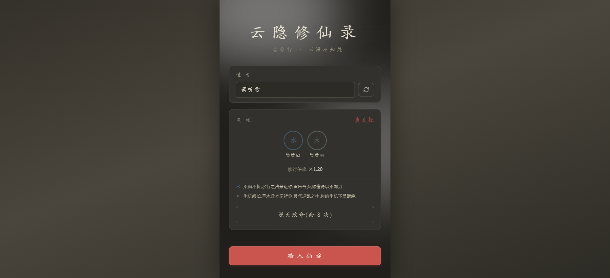
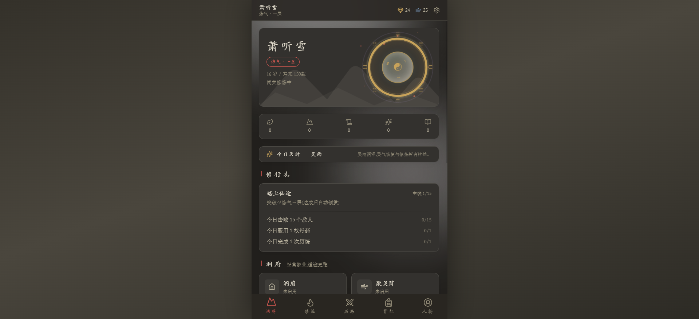

<div align="center">
  

  > 一念修行 · 云深不知处
  一款文字版修仙放置游戏，采用中国风视觉设计。

  [](https://github.com/setube/yunyin-xiuxian/releases/latest)
  [](https://creativecommons.org/licenses/by-nc/4.0)
</div>

## 游戏特色

**四界二十一境** — 人间界（炼气→渡劫）、仙界（真仙→大罗）、神界（神人→神帝）、混沌海（混沌真灵→混沌道祖）四重界域；每境九层至圆满，突破需渡劫，5 类天劫（雷鸣/逆流/裂魂/铁躯/重压）各有克制之法

**灵根定命** — 11 种灵根（金木水火土 + 风雷冰光暗 + 混沌），决定修炼速度、天劫减免与功法契合；33 种天赋分凡赋/灵赋/天赋/道赋四等

**功法悟道** — 63 部功法分主修、辅修、秘术三类，可同时装配；练至圆满开启悟道分支，141 条分支让同一部功法走出不同流派

**历练探险** — 44 个区域自青云山麓铺到混沌海的道祖悟道崖，132 种敌人；派遣式历练按时间安排遭遇，81 个随机事件 + 11 类机缘穿插其间，首领通关解锁下一区

**回合制战斗** — 战斗在后台一次性完整解算再回放：速度先手、暴击闪避、护盾吸血、反击连击、控制、法宝、流派组合技（玄罡反震/枯泽回春/锋连诀）全部参与推演

**装备构筑** — 10 个装备槽位、288 种模板、113 条词条、9 级品质（凡品→神品）；同类词条按 1/0.75/0.5/0.25 递减，攻击生命速度等超过软阈值后收益衰减，逼你搭配而非单堆

**器魂形意** — 销毁装备凝出 6 类 6 阶器魂（锋/盾/棘/连/泽/背），3 个装配槽位：装备照常作数，器魂是**叠加**上去的一层路数；天界/神界的难处由敌人一侧承担——道之理解（你越厚，守关者越有备）与境界压制

**洞府经营** — 7 种建筑（洞府/聚灵阵/炼丹炉/炼器台/灵田/藏经阁/灵兽园）离线产出，4 条灵脉（青木/赤炎/玉髓/寒冥）可投资分红

**炼丹炼器** — 9 门技艺（识材/辨药/配伍/凝丹/淬药/养丹/控火/锻打/铭纹）各自成长，50 种丹药、45 件法宝；技艺不足不是"不能炼"，而是炼出什么样的成品

**灵兽相伴** — 14 只灵兽（青羽灵狐/雪背小龟/赤火雀/月影狸/三足金蟾/摇光鹿/御雷猴/螭龙幼子/应龙/青鸾/麒麟/白泽/鲲鹏/混沌饕餮），每界至少两只可挑；出战加成各异，性子还会改历练中的遭遇走向

**星命卦象** — 星象二十八宿分野四界，紫微十二宫十四主星定一世底色，周易八卦推六十四重卦问一时之机，奇门八门择门而入改这一趟打法

**道侣师承** — 10 位道侣各有目标、性子与修行路，4 位师尊各给一条方向性理念；两者都不进效率链，只让这一世变得不一样

**轮回转世** — 寿元耗尽入轮回，5 个阶段（初入轮回→熟知凡间→熟知修仙界→熟知天界→百世老修）逐世积累"见识"；17 种人生主题决定这一世的开局与禁忌，老修可自选

**真仙终局** — 4 条道途（剑道/长生道/天机道/杀伐道）、4 重天界（赤炎天/万刃天/无生天/无相天）远征、3 种试炼、6 种契约、8 类变数组合出每周期不同的规则宇宙；另有短期秘境与天道熔炉

**图鉴收藏** — 灵材谱、悟道录、敌人志、典籍志逐条解锁；62 个成就、32 个主线任务、29 枚称号与每日任务贯穿全程

**国风音画** — Tone.js 播放 FluidR3 真实乐器采样：古筝主旋律、琵琶对答、木鱼点击、太鼓鼓点、编钟突破、编磬提示

## 游戏截图





## 快速开始

需要 [Bun](https://bun.sh) 1.2+。

```bash
# 安装依赖
bun install

# 启动开发服务器
bun dev

# 类型检查 + 生产构建
bun run build

# 预览构建结果
bun preview

# 全量测试（数值/战斗/流派/曲线/经济/回归/终局/决策，155 个 spec）
# 注意用 bun run test,不能用 bun test —— 后者会调 Bun 自带的测试器而非 Vitest
bun run test

# 按系统分类的测试摘要
bun run test:report

# 类型检查 + ESLint
bun run check
```

### 多端构建

```bash
# Windows 桌面客户端（Electron，输出 pkg/*.zip）
bun run build:electron

# 同步 Web 产物到 Android 工程（Capacitor）
bun run build:android

# 直接出 Release APK（签名读仓库内的 android/keystore.properties + release.keystore，见下）
bun run build:apk
```

> **关于 Android 签名**：签名密钥（`android/release.keystore`）与口令（`android/keystore.properties`）随仓库分发，clone 下来即可出可安装的签名包，CI 也不需要任何 Secret。这只提供「用同一把钥匙签出的 APK」这一致性，**不构成官方性与防伪**——任何克隆仓库的人都能用它签出包，请以本仓库 release 页发布的 APK 与 Docker 镜像为准。要换一把不进仓库的密钥时，环境变量 `KEYSTORE_STORE_PASSWORD` / `KEYSTORE_KEY_PASSWORD` 或不入库的 `android/keystore.local.properties` 可覆盖文件里的口令。

### 多端安装

- **Web / PWA**：直接部署 `dist/`（或走下方 Docker 镜像），移动浏览器打开即玩，可「添加到主屏幕」；Service Worker 会缓存静态资源，**首次在线打开后，断网重开也能进游戏**（发版更新仍即时生效，不卡旧版本）。**iOS 上请务必「添加到主屏幕」**：Safari 会在网页七天没被打开后清掉它的本地数据（存档与离线缓存一起没），而已安装的 Web App 不受这条规则约束——游戏检测到这种情况会在主页提示一次，设置页里也常驻可查。
- **Android**：CI 会把签好的 APK 作为 `android-apk` 产物上传；本地出包在 `android/app/build/outputs/apk/release/yunyin-<版本号>.apk`。把 APK 传到手机后点击安装（系统会提示允许安装未知来源应用，放行即可；覆盖安装需签名一致——自己构建的包与官方签名不同，需先卸载旧版）。
- **Windows 桌面（Electron）**：首次安装下 `yunyin-<版本号>-win.zip`（约 130 MB，含运行时），解压后运行其中的 `云隐修仙录.exe`；杀毒软件若误报，是未签名 exe 的通病，可加入白名单。
  **已装过的玩家升级只需增量包** `yunyin-<版本号>-win-update.zip`（约 4 MB）：解压到安装目录（与 `云隐修仙录.exe` 同级）覆盖即可。若某版发布说明注明「Electron 运行时已升级」，则需重新下完整包。
- **自建站**：`yunyin-<版本号>-web.zip` 就是 `dist/` 的内容，解压后整个目录扔给任意静态服务器即可（也可走下方 Docker 镜像）。

推送到 `main` 会经 GitHub Actions 走同一道闸：类型检查、ESLint、单元测试全绿后才部署 Web/PWA 到 Pages、推送 Docker 镜像。

**发版是一个显式动作 —— 推 tag。** 构建 Electron 与 Android 产物、发布 Release 的那条流水线只在 tag 上触发：

```bash
# 1. 先提 package.json 的版本号(它决定 APK 的 versionName/versionCode)
# 2. 打 tag 并推上去
git tag v1.34.0
git push origin main v1.34.0
```

这条流水线第一件事是核对 tag 与 package.json 是否同一个版本，对不上直接红掉 —— 免得发出「Release 页写着 v1.34.0、装到手机上却是 1.33.0」的包。

### Docker 部署

```bash
# 方式一：使用预构建镜像（推荐）
docker run -d -p 8080:80 ghcr.io/setube/yunyin-xiuxian:latest

# 方式二：指定版本
docker run -d -p 8080:80 ghcr.io/setube/yunyin-xiuxian:<version>

# 方式三：本地构建镜像
docker build -t yunyin-xiuxian .
docker run -d -p 8080:80 yunyin-xiuxian
```

访问 `http://localhost:8080` 即可开始游戏。反向代理、docker-compose 与子路径部署见 [README.Docker.md](README.Docker.md)。

## 技术栈

| 技术            | 版本  | 用途                                        |
| --------------- | ----- | ------------------------------------------- |
| Vue 3           | 3.5   | 组合式 API + `<script setup>`               |
| TypeScript      | 6.0   | strict 严格类型检查                         |
| Vite            | 8     | 构建与开发服务器（legacy 插件兜旧 WebView） |
| Pinia           | 3     | 状态管理（14 个 store，自动持久化）         |
| Tailwind CSS    | 3.4   | 水墨色系语义色与暗色主题                    |
| Vue Router      | 4     | 客户端路由（hash 模式）                     |
| Tone.js         | 15    | FluidR3 乐器采样播放（BGM + SFX）           |
| CryptoJS        | 4     | 存档 AES 加密                               |
| lucide-vue-next | 0.577 | 图标库                                      |
| Vitest          | 5     | 单元测试与平衡审计（155 个 spec）           |
| Electron        | 39    | Windows 桌面客户端打包                      |
| Capacitor       | 8     | Android 客户端打包                          |

## 项目结构

```text
src/
├── data/                 # 内容层：纯静态声明式定义（48 个模块）
│   ├── realms.ts             # 4 界域 · 21 境界
│   ├── regions.ts            # 44 区域
│   ├── enemies.ts            # 132 敌人
│   ├── equipment.ts          # 288 装备模板(一阶一名)
│   ├── affixes.ts            # 113 词条
│   ├── gongfa.ts             # 46 功法
│   ├── gongfaBranches.ts     # 107 悟道分支
│   ├── pills.ts              # 50 丹药
│   ├── artifacts.ts          # 45 法宝
│   ├── souls.ts              # 6 类 6 阶器魂
│   ├── xiangxiu.ts           # 28 星宿 · 四象
│   ├── ziwei.ts              # 12 宫 · 14 主星
│   ├── yijing.ts             # 8 卦 · 64 重卦
│   ├── qimen.ts              # 奇门八门
│   ├── daolu.ts              # 道侣
│   ├── endgame.ts            # 道途 / 天界 / 试炼
│   ├── mutators.ts           # 8 变数
│   └── constants.ts          # 全局平衡参数
├── core/                 # 逻辑层（102 个模块 + 143 个 spec）
│   ├── engine.ts             # 在线心跳驱动（1000ms）
│   ├── offline.ts            # 离线收益结算
│   ├── combat.ts             # 回合制战斗预解算
│   ├── formulas.ts           # 数值公式
│   ├── statsCalc.ts          # 属性聚合（词条递减 + 软阈值）
│   ├── equipGen.ts           # 装备实例生成
│   ├── exploration.ts        # 历练状态机
│   ├── loot.ts               # 掉落总入口
│   ├── progress.ts           # 任务成就横向总线
│   ├── worldGen.ts           # 终局世界生成（三重审计门）
│   └── *Service.ts           # 各系统服务（另有 *Sim.ts 平衡模拟器）
├── stores/               # Pinia 状态（14 个，绝大部分自动持久化）
├── views/                # 17 个页面
├── components/           # 组件（8 组）
├── ui/                   # 图标、词条名、图鉴与提示等展示层数据
├── utils/                # GNum 大数（m×10^e）/ 格式化 / 随机 / 存档底层
├── composables/          # useNow 等
├── types/                # 领域类型定义
└── router/               # 路由与首次流程守卫
```

## 游戏系统一览

| 系统 | 说明                                                                         |
| ---- | ---------------------------------------------------------------------------- |
| 境界 | 4 界域 × 21 境 × (九层 + 圆满)，突破渡劫，5 类天劫                           |
| 灵根 | 11 种（五行 + 风雷冰光暗 + 混沌），影响修速、劫难减免、功法契合              |
| 天赋 | 33 种，分凡赋 / 灵赋 / 天赋 / 道赋四等                                       |
| 功法 | 63 部（主修 / 辅修 / 秘术），圆满后开启 141 条悟道分支                        |
| 历练 | 44 区域 × 132 敌人，派遣制会话，81 事件 + 11 机缘，首领解锁下一区            |
| 战斗 | 后台完整预解算再回放，速度 / 暴击 / 护盾 / 吸血 / 反击 / 控制 / 组合技       |
| 装备 | 32 阶 × 9 部位 = 288 模板（一阶一名）× 113 词条 × 9 品质，词条递减 + 软阈值      |
| 器魂 | 飞升后数值归零，6 类 × 6 阶器魂占 3 个槽位，改路数而非堆数值                 |
| 洞府 | 7 建筑离线产出 + 4 条灵脉投资分红                                            |
| 技艺 | 9 门（识材 / 辨药 / 配伍 / 凝丹 / 淬药 / 养丹 / 控火 / 锻打 / 铭纹）独立成长 |
| 炼制 | 50 丹药 + 45 法宝，技艺水平决定成品品相而非成败                              |
| 灵兽 | 14 只，每界至少两只可挑，出战加成与性子各异                                                    |
| 术数 | 星象 28 宿 · 紫微 12 宫 14 主星 · 周易 64 重卦 · 奇门八门                    |
| 人缘 | 10 位道侣 + 4 位师承，只给方向与叙事，不进效率链                             |
| 轮回 | 5 阶段积累见识，17 种人生主题定开局与禁忌                                    |
| 终局 | 4 道途 + 4 天界远征 + 3 试炼 + 6 契约 + 8 变数 + 短期秘境 / 天道熔炉         |
| 任务 | 32 主线任务 + 每日任务 + 62 成就 + 29 称号 + 图鉴（灵材谱 / 悟道录 / 敌人志 / 典籍志） |

## 设计规范

- **配色**：水墨色系。`style.css` 存裸 RGB 通道变量（`--color-x-rgb`），`tailwind.config.js` 用 `rgb(var(...) / <alpha-value>)` 合成语义色 —— 斜杠透明度与 `color-mix` 两条路径共用一份变量，夜间主题只覆盖通道值一处即可同时换肤
- **版式**：竖版文字风格，移动端优先
- **字体**：正文走系统字体栈；标题、境界名、名号走 `font-kai`（楷体），**三端统一用随包内置的那份霞鹜文楷子集**（`src/assets/fonts/`，1.7MB）—— iOS 的华文楷体、Windows 的楷体（还属「中文补充字体」，没装的机器本就没有）各是各的字形，同一款游戏摆在一起是三种气质。用的这一支是**GB 屏幕阅读版**：GB 版按 G 源改了字形（原版源自日本的 Klee One，「这 边 过 运」的辶旁是日式两点辶），屏幕阅读版把笔画调实，10~13px 的小字清楚得多。系统楷体退到字体栈第二位，只替子集盖不住的生僻字兜底。重做子集（加了新内容、字表不够用时）：`uv run scripts/fonts/build-kai-font.py`
- **动效**：`rise-in` / `shimmer` / `pulse-ring` / `bar-grow` 等关键帧，`.stagger-in` 入场序列
- **无障碍**：`prefers-reduced-motion` 全局禁用动画

## 参与贡献

- 从 `main` 拉分支改,改完开 Pull Request。PR 会自动跑「PR 校验」(类型检查 + ESLint + 单元测试 + 生产构建),**红了合不进去**——这是仓库规则集要求的合并前状态检查。
- `main` 受规则集保护:不可删除、不可强推、只能经 PR 合入;`v*` 发版 tag 同样受保护,不可被创建 / 移动 / 删除。仓库管理员可绕过,用于直接推送与发版。
- 从 fork 提 PR 前请先同步上游 `main`(fork 页面的 Sync fork),**不要重写 fork 的历史**——合并基一断,PR 就做不出来了。
- `main` 历史必须**线性**:合入 PR 一律 `gh pr merge <编号> --rebase` 或 `--squash`,严禁 `--merge`(GitHub 的「Create a merge commit」会在 main 上产生双亲 merge 节点);同步主干先 `git fetch origin main` 再 `git rebase origin/main`——不要基于过时的本地主干 rebase,也不要「Merge main into …」(`.github/workflows/history-linear.yml` 会在 PR 期把这类提交判为失败)。权威合并期闸门(仅仓库 owner 可开):Settings → Rules → main 规则集 → 添加规则「Require a linear history」,开启后未经绕过的合并会被 GitHub 直接禁止(管理员/规则集绕过者仍可经绕过路径合入 merge 提交)。详见 AGENTS.md「历史线性」条款。
- 新账号 24 小时内暂不能评论 / 提 issue / 提 PR(仓库开了最低档的互动限制,挡一次性小号)。

## 交流

- QQ 群：[920930589](https://qm.qq.com/q/2BVaTTwDkI)
- 在线试玩：[yunyin.wenzi.games](https://yunyin.wenzi.games)

## 许可证

本项目采用 [CC BY-NC 4.0](https://creativecommons.org/licenses/by-nc/4.0/deed.zh-hans) 许可协议。

允许自由共享和演绎，但 **未经作者书面授权，禁止用于任何商业目的**。详见 [LICENSE](LICENSE) 文件。

**第三方资源**：内置的楷体子集取自 [霞鹜文楷 LXGW WenKai](https://github.com/lxgw/LxgwWenKai)，按 SIL OFL 1.1 分发（协议全文随产物一起放在 `public/fonts/OFL.txt`）。它的授权与本项目的 CC BY-NC 4.0 各自独立 —— 该字体允许商用，但再分发时请保留协议文本与字体名。
